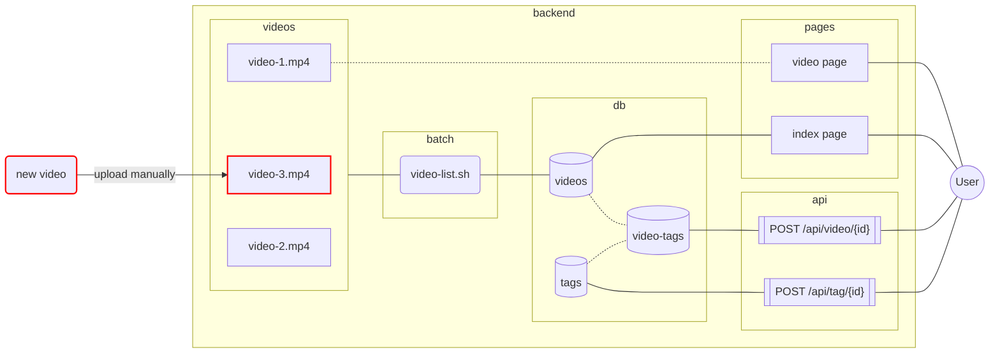

### SUMMARY

- 動画は手動でアップロードする (自宅動画サーバーなので...)
  - 手動アップなので、バッチで動画一覧を更新する
- 個別の動画ページから、タグを更新する
  - TODO: 評価もほしい気がしている

```mermaid
flowchart LR

%% uploading
video -->|upload manually| video3
videos --- sh-video-list --- video-list --- index

%% browzing
video1 -.- video-page --- user
index --- user
video-tags --- post-video --- user
tags --- post-tag --- user

%% entity relation
video-list -.- video-tags
tags -.- video-tags

subgraph backend
  subgraph pages
    index["index page"]
    video-page["video page"]
  end
  subgraph api
    post-video[["POST /api/video/{id}"]]
    post-tag[["POST /api/tag/{id}"]]
  end
  subgraph db
    video-list[("videos")]
    tags[("tags")]
    video-tags[("video-tags")]
  end
  subgraph videos
    direction LR
    video1["video-1.mp4"]
    video2["video-2.mp4"]
    video3["video-3.mp4"]:::new
  end
  subgraph batch
    sh-video-list(video-list.sh)
  end
end
user(("User"))
video("new video"):::new

classDef new stroke-width:2px,stroke:red;
```
